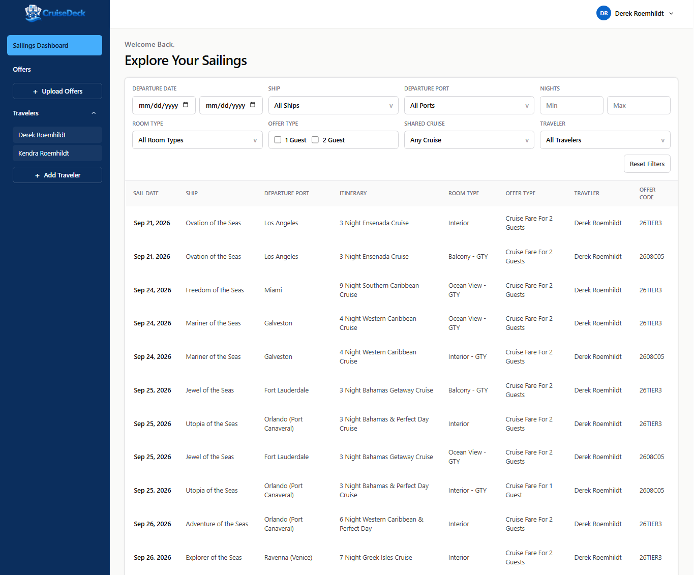

# Cruise Deck

Cruise Deck is a full-stack application for organizing cruise offers, managing travelers, and exploring individual sailing options. Built with React and TypeScript, it features AWS Cognito-backed authentication, private S3 uploads, asynchronous offer processing, DynamoDB-backed account data, a typed Hono API, and AWS infrastructure managed with CDK.

## Live Website

**[https://www.cruise-deck.derek-dev.com](https://www.cruise-deck.derek-dev.com)**



## Tech Stack

- **Frontend:** React, TypeScript, Vite, Tailwind CSS
- **Backend:** Hono, AWS Lambda, API Gateway
- **Infrastructure:** AWS CDK, S3, CloudFront, Route 53
- **Authentication + Database:** Amazon Cognito, DynamoDB
- **CI/CD + Tooling:** GitHub Actions, pnpm, Biome

## Repo Structure

- `ui` - React application built with Vite
- `ui/src/pages` - Application pages and routing
- `ui/src/components` - Reusable UI components
- `ui/src/auth` - Authentication provider and protected-route helpers
- `ui/src/api` - Typed API clients and shared request helpers
- `ui/src/app-data` - App-level data providers and small client-side caches shared across protected routes
- `api` - Serverless Hono API
- `api/src/lambdas` - Lambda entry points and route handlers
- `api/src/contracts` - Shared API types and validators
- `api/src/lib` - API services, parsing logic, and lower-level helpers
- `infra` - AWS CDK infrastructure
- `.github/workflows/deploy.yml` - Automated deployment workflow

## Local Development

**Prerequisites**

- Node.js `24.12.0`
- pnpm `10.28.2`
- AWS CLI with configured SSO access to deployed resources

From the repository root:

- `pnpm install` - Install dependencies
- `pnpm run local-ui` - Start the Vite development server
- `pnpm run local-api` - Start the Hono API
- `pnpm run local` - Start both UI and API

The local API automatically loads `api/.env` when present. Create it from the provided template:

```powershell
Copy-Item api/.env.example api/.env
```

Configure the following environment variables:

- `USER_POOL_ID` - Deployed Cognito user pool ID
- `USER_POOL_CLIENT_ID` - Deployed Cognito web app client ID
- `CRUISE_DECK_DATA_TABLE_NAME` - Deployed DynamoDB table name for account, traveler, offer, and sailing data
- `OFFERS_BUCKET_NAME` - Deployed private S3 bucket name for uploaded offer files


The remaining local defaults can be left as configured in `api/.env.example`. Required Cognito, DynamoDB, and S3 values are available in the API stack's CDK outputs.

Local development uses this project's deployed AWS resources. Deploy the project first, then populate `api/.env` with its corresponding configuration.

Authenticate with AWS SSO before running the local API:

- `pnpm run sso` - Authenticate with AWS SSO

**Local URLs**

- UI: `http://localhost:5173`
- API: `http://localhost:8787`

The UI uses `VITE_API_URL` when set. Otherwise, it calls `http://localhost:8787` in development and the current site origin in production.

## Validation

From the repository root:

- `pnpm run typecheck` - Run all package typechecks
- `pnpm run format` - Apply Biome formatting and fixes
- `pnpm run build` - Build all packages

## API

The auth Hono app lives in `api/src/lambdas/auth.ts` and exposes:

- `GET /health`
- `POST /auth/signup`
- `POST /auth/confirm-signup`
- `POST /auth/resend-code`
- `POST /auth/login`
- `POST /auth/refresh`
- `POST /auth/forgot-password`
- `POST /auth/confirm-forgot-password`
- `POST /auth/logout`
- `GET /me`
- `PUT /me`

The offers Hono app lives in `api/src/lambdas/offers.ts` and exposes:

- `GET /offers`
- `POST /offers`
- `GET /offers/{offerId}/download`
- `DELETE /offers/{offerId}`

The travelers Hono app lives in `api/src/lambdas/travelers.ts` and exposes:

- `GET /travelers`
- `POST /travelers`
- `PUT /travelers/{travelerId}`
- `DELETE /travelers/{travelerId}`

The sailings Hono app lives in `api/src/lambdas/sailings.ts` and exposes:

- `GET /sailings`

The API stores Cognito access, ID, and refresh tokens in HTTP-only cookies. The UI does not store authentication tokens in localStorage.

The UI uses Hono's typed client from `hono/client` for auth calls and shared API response/request types from the `api` workspace package. Authenticated API requests send cookies with each request and retry once through `/auth/refresh` when an authenticated request returns `401`.

The `/app`, `/offers`, and `/travelers` UI routes are protected by the auth provider. If `/me` cannot resolve a signed-in user, the user is routed back to `/`.

Authentication supports self-signup with user-defined passwords and email verification through Amazon Cognito. When a user signs up, the auth API also creates the user's base traveler in DynamoDB from the signup first and last name.

## Travelers, Offers, and Sailings

Cruise Deck keeps account-owned app data in one DynamoDB table using a single-table style key pattern:

- `PK = USER#<userSub>` groups one user's account data
- `SK = ACCOUNT#METADATA` stores account setup metadata, including the default traveler ID
- `SK = TRAVELER#<travelerId>` stores traveler records
- `SK = OFFER#<offerId>` stores uploaded offer metadata

Uploaded offer files are stored in the private offers S3 bucket. DynamoDB stores offer metadata including `travelerId`, `fileName`, `sizeBytes`, `uploadedAt`, and `sourceS3Key` for download and delete operations.

The Offers page loads travelers and offers together. When uploading offer files, one traveler is preselected if the account has only one traveler; otherwise the user must choose the traveler before upload. Traveler records can be added, edited, and deleted, but the app and API prevent deleting the final remaining traveler for an account.

New offer files trigger the parse-offer Lambda. Parsed sailing data is stored in DynamoDB and served through `/sailings` with filters for dates, ships, ports, room types, travelers, shared travelers, guest counts, and trip length.

## Infrastructure

The CDK app lives in `infra` and defines two stacks:

- `cruise-deck-api`
- `cruise-deck-ui`

CDK context in `infra/cdk.json` controls the hosted domain:

- `rootDomain` - Route 53 hosted zone domain
- `hostedZoneId` - Route 53 hosted zone ID
- `siteSubdomain` - Subdomain deployed by this project; leave empty to deploy at the root domain

The UI stack deploys the built UI from `ui/dist` to `cruise-deck.derek-dev.com` by default.

The UI stack creates:

- Private S3 bucket for static site assets
- CloudFront distribution with Origin Access Control
- CloudFront proxy behaviors for `/auth/*`, `/offers`, `/offers/*`, `/sailings`, `/travelers`, `/travelers/*`, `/me`, and `/health` so the deployed UI calls the API through the same site origin
- CloudFront Function SPA routing for extensionless UI paths like `/verify`
- ACM certificate for the primary domain and `www` domain
- Route 53 A and AAAA alias records for both domains
- Bucket deployment with CloudFront invalidation

The API stack creates:

- Cognito user pool
- Cognito user pool client
- DynamoDB table for account metadata, travelers, offers, and parsed sailings
- Private S3 bucket for uploaded offer files
- HTTP API Gateway
- `cruise-deck-auth` Lambda backed by the auth Hono API
- `cruise-deck-offers` Lambda for offer uploads, listing, downloads, and deletes
- `cruise-deck-parse-offer` Lambda triggered by new offer files in S3
- `cruise-deck-sailings` Lambda for parsed sailing listings
- `cruise-deck-travelers` Lambda for traveler management
- API Gateway route integrations for auth, offers, sailings, and travelers routes

## Deployment

### Automated (GitHub Actions)

The workflow runs on pushes to `main` and supports manual dispatches.

- Installs Node.js and pnpm
- Installs dependencies using `pnpm install --frozen-lockfile`
- Assumes the AWS IAM role configured in `AWS_DEPLOY_ROLE_ARN`
- Executes `pnpm run github-action-deploy`
- Deploys to AWS `us-east-1`

### Manual (AWS SSO)

For local deployments, authenticate with AWS SSO and deploy using:

- `pnpm run sso` - Authenticate with AWS SSO
- `pnpm run diff` - Preview infrastructure changes
- `pnpm run synth` - Synthesize the CDK stacks
- `pnpm run deploy` - Deploy the CDK stacks
